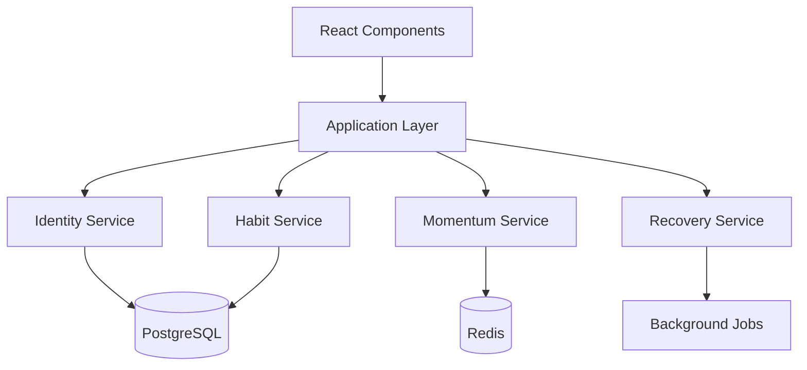

# Tiny Wins: Technical Specifications & Development Guidelines

_Comprehensive architectural guide for the micro-habits app that builds identity through showing up_

---

## Table of Contents

1. [System Architecture](#system-architecture)
2. [Development Guidelines](#development-guidelines)
3. [Technical Requirements](#technical-requirements)
4. [Implementation Roadmap](#implementation-roadmap)
5. [Data Models & API Design](#data-models--api-design)
6. [Performance Requirements](#performance-requirements)
7. [Security Architecture](#security-architecture)
8. [Testing Strategy](#testing-strategy)
9. [Deployment & DevOps](#deployment--devops)
10. [Quality Assurance](#quality-assurance)

---

## System Architecture

### Overall Architecture Pattern

**Architecture**: Clean Architecture with Event-Driven Components

- **Domain Layer**: Core business logic (habit formation, identity tracking)
- **Application Layer**: Use cases and orchestration
- **Infrastructure Layer**: External services, storage, API clients
- **Presentation Layer**: React/Next.js components with shadcn/ui

### Technology Stack

#### Frontend

```typescript
Core Framework: Next.js 14+ (App Router)
UI Library: shadcn/ui with extensive customizations
Styling: Tailwind CSS with custom design tokens
State Management: Zustand (lightweight, psychology-focused state)
Animation: Framer Motion (gentle, celebrating transitions)
PWA: next-pwa for offline functionality
Testing: Vitest + React Testing Library + Playwright
```

#### Backend

```typescript
API: Next.js API Routes (Edge Runtime preferred)
Database: PostgreSQL with Prisma ORM
Caching: Redis for session data and habit streaks
Authentication: NextAuth.js with multiple providers
Background Jobs: Vercel Cron Jobs for notifications
Analytics: Custom implementation (privacy-focused)
```

#### Infrastructure

```yaml
Platform: Vercel (optimized for Next.js)
Database: PlanetScale or Supabase PostgreSQL
Cache: Upstash Redis
Storage: Vercel Blob for user data exports
Monitoring: Vercel Analytics + Custom health checks
```

### System Boundaries & Services

#### Core Domains

1. **Identity Domain**: User identity transformation tracking
2. **Habit Domain**: Micro-habit creation, management, completion
3. **Momentum Domain**: Pattern visualization and streak management
4. **Recovery Domain**: Missed day handling and comeback flows
5. **Notification Domain**: Gentle reminder system

#### Service Architecture



---

## Development Guidelines

### Code Organization Structure

```
src/
├── app/                          # Next.js App Router
│   ├── (auth)/                   # Authentication routes
│   ├── (main)/                   # Main app routes
│   ├── api/                      # API endpoints
│   └── globals.css               # Psychology-informed CSS
├── components/
│   ├── ui/                       # shadcn/ui base components
│   ├── features/                 # Feature-specific components
│   ├── layouts/                  # Layout components
│   └── pages/                    # Page-level components
├── lib/
│   ├── db/                       # Database schemas and queries
│   ├── services/                 # Business logic services
│   ├── utils/                    # Utility functions
│   └── validations/              # Input validation schemas
├── hooks/                        # Custom React hooks
├── stores/                       # Zustand state stores
├── types/                        # TypeScript type definitions
└── constants/                    # App constants and configs
```

### Coding Standards

#### TypeScript Configuration

```json
// tsconfig.json
{
  "compilerOptions": {
    "strict": true,
    "noUncheckedIndexedAccess": true,
    "exactOptionalPropertyTypes": true,
    "noImplicitReturns": true,
    "noFallthroughCasesInSwitch": true
  },
  "include": ["**/*.ts", "**/*.tsx"],
  "exclude": ["node_modules"]
}
```

#### Component Patterns

```typescript
// Required: All components must have proper TypeScript interfaces
interface HabitCardProps {
  habit: Habit;
  isCompleted: boolean;
  onComplete: (habitId: string) => void;
  onLifeHappened: (habitId: string) => void;
  className?: string;
}

// Required: Use forwardRef for components that may need refs
export const HabitCard = forwardRef<HTMLDivElement, HabitCardProps>(
  ({ habit, isCompleted, onComplete, onLifeHappened, className }, ref) => {
    // Component implementation
  }
);

// Required: Display name for debugging
HabitCard.displayName = 'HabitCard';
```

#### State Management Patterns

```typescript
// Zustand stores with TypeScript and psychology-focused naming
interface HabitStore {
  // State
  habits: Habit[];
  todaysCompletions: Record<string, boolean>;
  weeklyMomentum: boolean[];

  // Actions (psychology-focused naming)
  celebrateShowingUp: (habitId: string) => void;
  acknowledgeLifeHappened: (habitId: string) => void;
  welcomeBack: () => void;

  // Computed values
  identityProgress: () => number;
  momentumScore: () => number;
}

export const useHabitStore = create<HabitStore>((set, get) => ({
  // Implementation with psychology-first approach
}));
```

### Component Development Rules

#### Psychology-First Development

1. **Celebration Over Completion**: Every success interaction must trigger positive feedback
2. **Forgiveness by Design**: No red colors, no shame language, always provide alternatives
3. **Identity Amplification**: Consistently reinforce user's evolving identity
4. **Gentle Persistence**: Encourage without pressuring or creating anxiety

#### Accessibility Requirements

```typescript
// Required: All interactive elements must be keyboard accessible
export function AccessibleButton({ children, ...props }: ButtonProps) {
  return (
    <button
      {...props}
      className={cn("touch-friendly focus-visible:ring-2", props.className)}
      onKeyDown={(e) => {
        if (e.key === 'Enter' || e.key === ' ') {
          e.preventDefault();
          props.onClick?.(e);
        }
      }}
    >
      {children}
    </button>
  );
}

// Required: Screen reader announcements for state changes
const announceSuccess = (habitName: string) => {
  const announcement = `${habitName} completed. Great job showing up!`;
  announceToScreenReader(announcement);
};
```

#### Animation Guidelines

```typescript
// Required: All animations must be gentle and celebratory
const celebrationVariants = {
  initial: { scale: 1, opacity: 1 },
  celebrate: {
    scale: [1, 1.05, 1],
    opacity: [1, 0.9, 1],
    transition: { duration: 1.5, ease: 'easeOut' },
  },
};

// Required: Respect user's motion preferences
const shouldAnimate = !window.matchMedia('(prefers-reduced-motion: reduce)')
  .matches;
```

---

## Technical Requirements

### Performance Benchmarks

#### Core Performance Metrics

```yaml
First Load (Home Screen): < 2 seconds
Habit Check-in Interaction: < 200ms response time
Daily Flow Completion: < 10 seconds total
Bundle Size: < 500KB initial load
Core Web Vitals:
  LCP (Largest Contentful Paint): < 2.5s
  FID (First Input Delay): < 100ms
  CLS (Cumulative Layout Shift): < 0.1
```

#### Offline Functionality Requirements

```typescript
// Required: Core features must work offline
const offlineCapabilities = {
  habitCheckin: true, // Can mark habits complete offline
  momentumView: true, // Can view weekly momentum
  recoveryFlow: true, // Can access recovery features
  habitCreation: false, // Requires server validation
  dataExport: false, // Requires server processing
};

// Required: Progressive Web App configuration
const pwaConfig = {
  registerSW: true,
  workbox: {
    runtimeCaching: [
      {
        urlPattern: /^https:\/\/api\.tinywins\.app\/habits/,
        handler: 'CacheFirst',
        options: {
          cacheName: 'habits-cache',
          expiration: { maxEntries: 100, maxAgeSeconds: 24 * 60 * 60 },
        },
      },
    ],
  },
};
```

### Mobile-First Requirements

#### Touch Interaction Standards

```css
/* Required: Minimum touch target sizes */
.touch-friendly {
  @apply min-h-[48px] min-w-[48px];
}

/* Required: Safe area handling for all devices */
.safe-area-layout {
  padding-top: env(safe-area-inset-top);
  padding-bottom: env(safe-area-inset-bottom);
  padding-left: env(safe-area-inset-left);
  padding-right: env(safe-area-inset-right);
}

/* Required: Thumb-friendly zones for primary actions */
.primary-action-zone {
  @apply fixed bottom-0 left-0 right-0 p-4;
  padding-bottom: calc(1rem + env(safe-area-inset-bottom));
}
```

#### Responsive Breakpoints

```typescript
const breakpoints = {
  mobile: '320px - 767px', // Primary focus
  tablet: '768px - 1023px', // Enhanced features
  desktop: '1024px+', // Centered content, max 480px width
} as const;

// Required: Mobile-first CSS approach
const responsiveStyles = {
  // Base styles for mobile
  base: 'text-base p-4',
  // Tablet enhancements
  tablet: 'md:text-lg md:p-6',
  // Desktop optimizations
  desktop: 'lg:max-w-md lg:mx-auto',
};
```

### Accessibility Compliance (WCAG 2.1 AA)

#### Required Accessibility Features

```typescript
interface AccessibilityRequirements {
  colorContrast: {
    normalText: 4.5; // Minimum contrast ratio
    largeText: 3.0;
    focus: 3.0;
  };

  keyboardNavigation: {
    tabOrder: 'logical';
    focusVisible: 'always';
    trapFocus: 'modals';
  };

  screenReader: {
    landmarks: 'semantic';
    headings: 'hierarchical';
    liveRegions: 'status-updates';
  };

  motor: {
    clickTargets: '48px-minimum';
    timeouts: 'adjustable';
    motionSensitive: 'respectPreferences';
  };
}
```

---

## Implementation Roadmap

### Phase 1: Foundation (Weeks 1-2)

**Goal**: Establish core architecture and basic daily flow

#### Sprint 1.1: Project Setup

- [ ] Next.js 14 project initialization with App Router
- [ ] shadcn/ui installation and psychology-focused theme configuration
- [ ] Tailwind CSS with custom design tokens implementation
- [ ] TypeScript configuration with strict settings
- [ ] Basic project structure and coding standards documentation

#### Sprint 1.2: Core Components

- [ ] HabitCard component with celebration animations
- [ ] IdentityBadge component with day counting
- [ ] MomentumVisualization (7-day circles) component
- [ ] Button variants (showed-up, life-happened, completed)
- [ ] Basic layout components with safe area handling

### Phase 2: Core Functionality (Weeks 3-5)

**Goal**: Implement daily habit tracking and basic flows

#### Sprint 2.1: Data Layer

- [ ] Prisma schema design for habits, completions, and identity tracking
- [ ] Database setup (PostgreSQL) with proper indexing
- [ ] API routes for habit CRUD operations
- [ ] Basic authentication setup with NextAuth.js

#### Sprint 2.2: Daily Flow

- [ ] Home screen implementation with today's habits
- [ ] Habit completion flow with celebration animations
- [ ] "Life happened" alternative flow
- [ ] Basic weekly momentum visualization
- [ ] Offline functionality for habit check-ins

#### Sprint 2.3: State Management

- [ ] Zustand stores for habits, momentum, and UI state
- [ ] Local storage persistence for offline capabilities
- [ ] Optimistic updates for habit completions
- [ ] Error handling and retry mechanisms

### Phase 3: Habit Creation (Weeks 6-7)

**Goal**: Implement psychology-driven habit creation flow

#### Sprint 3.1: Forced Shrinking Flow

- [ ] Multi-step habit creation wizard
- [ ] Identity selection screen with presets
- [ ] Habit input with contextual suggestions
- [ ] Forced shrinking mechanism (minimum 3 iterations)
- [ ] Implementation planning (trigger + habit) step

#### Sprint 3.2: Habit Management

- [ ] Habit editing capabilities
- [ ] Habit deletion with confirmation
- [ ] Multiple habits support (maximum 3)
- [ ] Habit reordering and prioritization

### Phase 4: Recovery & Resilience (Weeks 8-9)

**Goal**: Build compassionate systems for missed days and comebacks

#### Sprint 4.1: Recovery Flows

- [ ] Missed day detection and gentle re-engagement
- [ ] "Welcome back" screen with compassionate messaging
- [ ] Pause functionality for difficult life periods
- [ ] Streak recovery without shame-based language

#### Sprint 4.2: Advanced Momentum

- [ ] Weekly review screens with insights
- [ ] Pattern recognition (difficult days, strong days)
- [ ] Momentum score calculation and display
- [ ] Long-term progress visualization

### Phase 5: Polish & Optimization (Weeks 10-12)

**Goal**: Enhance user experience and ensure production readiness

#### Sprint 5.1: Advanced Features

- [ ] Haptic feedback integration
- [ ] Push notification system (gentle reminders)
- [ ] Data export functionality
- [ ] Settings and preferences management

#### Sprint 5.2: Performance & Accessibility

- [ ] Performance optimization (bundle size, loading times)
- [ ] Full accessibility audit and improvements
- [ ] PWA optimization and offline experience
- [ ] Cross-browser testing and fixes

#### Sprint 5.3: Testing & Quality

- [ ] Comprehensive test suite (unit, integration, E2E)
- [ ] User acceptance testing
- [ ] Performance monitoring setup
- [ ] Error tracking and monitoring implementation

---

## Data Models & API Design

### Core Data Models

#### User & Identity

```typescript
interface User {
  id: string;
  email: string;
  createdAt: Date;
  updatedAt: Date;

  // Identity tracking
  primaryIdentity?: string;
  identityStartDate?: Date;

  // Preferences
  notificationPreferences: NotificationPreferences;
  accessibilitySettings: AccessibilitySettings;
}

interface Identity {
  id: string;
  userId: string;
  name: string; // e.g., "Reader", "Runner", "Writer"
  startDate: Date;
  isActive: boolean;
  dayCount: number; // Computed field
}
```

#### Habits & Completions

```typescript
interface Habit {
  id: string;
  userId: string;
  identityId: string;

  // Habit details
  name: string;
  icon?: string;
  description?: string;
  originalHabit?: string; // Before shrinking
  shrinkHistory: string[]; // Track shrinking process

  // Implementation details
  trigger?: string; // "After I wake up"
  implementation?: string; // "I will read one page"

  // Metadata
  isActive: boolean;
  createdAt: Date;
  updatedAt: Date;

  // Computed fields
  currentStreak: number;
  longestStreak: number;
  completionRate: number;
}

interface HabitCompletion {
  id: string;
  habitId: string;
  userId: string;

  // Completion details
  completedAt: Date;
  completionType: 'showed-up' | 'life-happened';
  note?: string;

  // Context
  dayOfWeek: number;
  timeOfDay: 'morning' | 'afternoon' | 'evening';
}

interface WeeklyMomentum {
  id: string;
  userId: string;
  habitId: string;

  // Week tracking
  weekStartDate: Date; // Monday
  completions: boolean[]; // 7 days, Monday to Sunday
  momentumScore: number; // 0-100

  // Computed insights
  strongDays: number[];
  difficultDays: number[];
  bounceBackRate: number;
}
```

### API Design Patterns

#### RESTful Endpoints with Psychology Focus

```typescript
// Habit management
GET    /api/habits                    // Get user's active habits
POST   /api/habits                    // Create new habit (with forced shrinking)
PUT    /api/habits/:id/show-up        // Mark habit as completed
PUT    /api/habits/:id/life-happened  // Mark day as "life happened"
DELETE /api/habits/:id               // Soft delete habit

// Identity tracking
GET    /api/identity                 // Get current identity progress
PUT    /api/identity/evolve          // Update identity (level up)

// Momentum and progress
GET    /api/momentum/weekly          // Get current week momentum
GET    /api/momentum/insights        // Get personalized insights
POST   /api/momentum/celebrate       // Record celebration event

// Recovery and resilience
POST   /api/recovery/welcome-back    // Record return after absence
PUT    /api/recovery/pause           // Pause habits temporarily
POST   /api/recovery/reset           // Reset after major life change
```

#### Real-time Updates Strategy

```typescript
// Server-Sent Events for live updates
interface HabitUpdate {
  type: 'completion' | 'momentum' | 'identity-progress';
  habitId: string;
  data: any;
  timestamp: Date;
}

// WebSocket alternative for immediate feedback
const celebrateCompletion = async (habitId: string) => {
  // Optimistic update
  updateLocalState(habitId, 'completed');

  // Trigger celebration immediately
  triggerCelebration();

  // Sync with server
  try {
    await api.post(`/habits/${habitId}/show-up`);
  } catch (error) {
    // Revert optimistic update if needed
    revertLocalState(habitId);
  }
};
```

---

## Performance Requirements

### Core Performance Metrics

#### Response Time Requirements

```yaml
Critical User Journeys:
  Habit Check-in: < 200ms (including animation start)
  Home Screen Load: < 1.5s (returning user)
  Habit Creation: < 500ms per step
  Recovery Flow: < 1s (empathy is time-sensitive)

Database Performance:
  Habit Queries: < 50ms
  Momentum Calculations: < 100ms
  Weekly Insights: < 200ms
  Identity Progress: < 50ms
```

#### Bundle Size Optimization

```typescript
// Code splitting strategy
const CreateHabitFlow = lazy(
  () => import('@/components/features/create-habit')
);
const WeeklyReview = lazy(() => import('@/components/features/weekly-review'));
const Settings = lazy(() => import('@/components/features/settings'));

// Critical CSS inlining
const criticalCSS = `
  /* Essential styles for first paint */
  .habit-card { /* inline critical styles */ }
  .primary-button { /* inline critical styles */ }
`;
```

#### Caching Strategy

```typescript
// Redis caching for frequently accessed data
interface CacheStrategy {
  userHabits: '1 hour'; // User's active habits
  weeklyMomentum: '30 minutes'; // Current week progress
  identityProgress: '1 hour'; // Identity day count
  completionHistory: '24 hours'; // Historical completion data
}

// Browser caching
const cacheHeaders = {
  '/api/habits': 'max-age=3600, stale-while-revalidate=86400',
  '/api/momentum': 'max-age=1800, stale-while-revalidate=3600',
  '/static/icons': 'max-age=31536000, immutable',
};
```

---

## Security Architecture

### Authentication & Authorization

#### Security Requirements

```typescript
interface SecurityRequirements {
  authentication: {
    providers: ['email', 'google', 'apple']; // Privacy-focused options
    sessionDuration: '30 days';
    refreshTokenRotation: true;
    deviceTracking: false; // Privacy-first approach
  };

  authorization: {
    model: 'user-owned-data'; // Users only access their own data
    apiRateLimit: '100 requests/minute';
    bruteForceProtection: true;
  };

  dataProtection: {
    encryption: 'AES-256';
    keyRotation: 'quarterly';
    dataMinimization: true; // Only collect necessary data
    rightToDelete: true; // GDPR compliance
  };
}
```

#### Privacy-First Implementation

```typescript
// Minimal data collection
interface UserData {
  // Required
  id: string;
  email: string; // For account recovery only

  // Optional (user-controlled)
  displayName?: string;
  timezone?: string;

  // Explicitly NOT collected
  // - Real name
  // - Phone number
  // - Location data
  // - Social media profiles
  // - Device fingerprinting data
}

// Data export (GDPR compliance)
const exportUserData = async (userId: string) => {
  return {
    habits: await getUserHabits(userId),
    completions: await getUserCompletions(userId),
    identity: await getUserIdentity(userId),
    // No analytics or tracking data included
  };
};
```

### API Security

#### Input Validation & Sanitization

```typescript
// Zod schemas for all API inputs
const CreateHabitSchema = z.object({
  name: z.string().min(1).max(100).trim(),
  identity: z.string().min(1).max(50),
  icon: z.string().emoji().optional(),
  trigger: z.string().max(200).optional(),
  shrinkHistory: z.array(z.string().max(200)).max(10),
});

// Rate limiting per user
const rateLimiter = rateLimit({
  windowMs: 15 * 60 * 1000, // 15 minutes
  max: 100, // Limit each user to 100 requests per windowMs
  message: 'Too many requests, please try again later.',
  standardHeaders: true,
  legacyHeaders: false,
});
```

---

## Testing Strategy

### Testing Pyramid

#### Unit Tests (70% of test coverage)

```typescript
// Psychology-focused test descriptions
describe('Habit Completion Flow', () => {
  it('should trigger celebration animation when user shows up', async () => {
    // Test celebration is triggered
  });

  it('should provide compassionate alternative when life happens', async () => {
    // Test "life happened" flow
  });

  it('should never use shame-based language in any state', async () => {
    // Test language consistency
  });
});

// Accessibility testing
describe('Accessibility Requirements', () => {
  it('should meet minimum touch target sizes', () => {
    // Test 48px minimum requirement
  });

  it('should provide screen reader announcements for state changes', () => {
    // Test ARIA live regions
  });
});
```

#### Integration Tests (20% of test coverage)

```typescript
// Full user journey testing
describe('New User Onboarding', () => {
  it('should complete first habit check-in within 60 seconds', async () => {
    // Test complete onboarding flow timing
  });

  it('should force habit shrinking minimum 3 times', async () => {
    // Test habit creation psychology requirements
  });
});

// API integration testing
describe('Habit API Integration', () => {
  it('should handle offline habit completions when back online', async () => {
    // Test offline-online sync
  });
});
```

#### End-to-End Tests (10% of test coverage)

```typescript
// Critical user paths
describe('Critical User Journeys', () => {
  test('Daily habit check-in flow', async ({ page }) => {
    // Complete daily flow under 10 seconds
  });

  test('Recovery after missed days', async ({ page }) => {
    // Test compassionate re-engagement
  });

  test('Habit creation with forced shrinking', async ({ page }) => {
    // Test complete creation flow
  });
});
```

### Performance Testing

```typescript
// Load testing configuration
const performanceTests = {
  habitCompletion: {
    target: '< 200ms response time',
    users: '1000 concurrent',
    duration: '10 minutes',
  },

  homePageLoad: {
    target: '< 1.5s first contentful paint',
    devices: ['mobile', 'tablet', 'desktop'],
    networks: ['3G', '4G', 'WiFi'],
  },
};
```

---

## Deployment & DevOps

### CI/CD Pipeline

#### GitHub Actions Workflow

```yaml
# .github/workflows/main.yml
name: Deploy Tiny Wins

on:
  push:
    branches: [main]
  pull_request:
    branches: [main]

jobs:
  test:
    runs-on: ubuntu-latest
    steps:
      - uses: actions/checkout@v4
      - uses: actions/setup-node@v4
        with:
          node-version: '18'
          cache: 'npm'

      - run: npm ci
      - run: npm run type-check
      - run: npm run lint
      - run: npm run test:unit
      - run: npm run test:integration

      # Accessibility testing
      - run: npm run test:a11y

      # Performance testing
      - run: npm run lighthouse:ci

  deploy:
    needs: test
    runs-on: ubuntu-latest
    if: github.ref == 'refs/heads/main'
    steps:
      - uses: actions/checkout@v4
      - uses: vercel/action@v1
        with:
          vercel-token: ${{ secrets.VERCEL_TOKEN }}
```

#### Environment Configuration

```typescript
// Environment-specific settings
interface EnvironmentConfig {
  development: {
    database: 'postgresql://localhost:5432/tinywins_dev';
    redis: 'redis://localhost:6379';
    logLevel: 'debug';
    enableAnalytics: false;
  };

  staging: {
    database: process.env.STAGING_DATABASE_URL;
    redis: process.env.STAGING_REDIS_URL;
    logLevel: 'info';
    enableAnalytics: false;
  };

  production: {
    database: process.env.DATABASE_URL;
    redis: process.env.REDIS_URL;
    logLevel: 'warn';
    enableAnalytics: true; // Privacy-compliant only
  };
}
```

### Monitoring & Observability

#### Error Tracking & Performance Monitoring

```typescript
// Sentry configuration for error tracking
const sentryConfig = {
  dsn: process.env.SENTRY_DSN,
  environment: process.env.NODE_ENV,

  // Performance monitoring
  tracesSampleRate: 0.1, // 10% of transactions

  // Privacy-focused settings
  beforeSend: (event) => {
    // Remove PII from error reports
    delete event.user?.email;
    delete event.user?.ip_address;
    return event;
  },
};

// Custom health checks
const healthChecks = {
  database: async () => {
    const result = await db.raw('SELECT 1');
    return result.rows.length === 1;
  },

  redis: async () => {
    const result = await redis.ping();
    return result === 'PONG';
  },

  criticalUserFlow: async () => {
    // Test habit completion API
    const response = await fetch('/api/health/habit-completion');
    return response.ok;
  },
};
```

---

## Quality Assurance

### Code Quality Standards

#### ESLint Configuration

```json
{
  "extends": [
    "@next/next",
    "@typescript-eslint/recommended",
    "plugin:accessibility/recommended"
  ],
  "rules": {
    "@typescript-eslint/no-unused-vars": "error",
    "@typescript-eslint/no-explicit-any": "error",
    "accessibility/accessible-emoji": "error",
    "react-hooks/exhaustive-deps": "error",

    // Psychology-focused custom rules
    "no-shame-language": "error", // Custom rule to prevent shame-based text
    "require-celebration": "warn", // Custom rule for success states
    "gentle-colors-only": "error" // Custom rule for color palette compliance
  }
}
```

#### Pre-commit Hooks

```json
{
  "husky": {
    "hooks": {
      "pre-commit": "lint-staged && npm run type-check",
      "pre-push": "npm run test:unit && npm run test:a11y",
      "commit-msg": "commitlint -E HUSKY_GIT_PARAMS"
    }
  },
  "lint-staged": {
    "*.{ts,tsx}": ["eslint --fix", "prettier --write"],
    "*.css": ["stylelint --fix", "prettier --write"]
  }
}
```

### User Experience Quality Gates

#### Required UX Checks Before Release

```typescript
interface UXQualityGates {
  psychology: {
    noCrimsonColors: boolean; // No red/shame colors anywhere
    celebrationAnimations: boolean; // Success states have celebrations
    gentleLanguage: boolean; // All copy is encouraging
    identityReinforcement: boolean; // Identity consistently shown
  };

  accessibility: {
    keyboardNavigation: boolean; // All features keyboard accessible
    screenReaderSupport: boolean; // Proper ARIA labels and live regions
    colorContrastRatio: number; // Minimum 4.5:1 for normal text
    touchTargetSizes: boolean; // Minimum 48px for all interactive elements
  };

  performance: {
    firstContentfulPaint: number; // < 1.5 seconds
    habitCompletionTime: number; // < 200ms
    onboardingTime: number; // < 60 seconds to first win
    dailyFlowTime: number; // < 10 seconds total
  };

  resilience: {
    offlineCapability: boolean; // Core features work offline
    gracefulDegradation: boolean; // Works without JavaScript
    errorRecovery: boolean; // Clear error states and recovery paths
  };
}
```

#### Release Checklist

```markdown
## Pre-Release Checklist

### Psychology Compliance

- [ ] No shame-based language anywhere in the app
- [ ] All success states trigger celebration animations
- [ ] "Life happened" alternatives available for all completion flows
- [ ] Identity reinforcement present on all screens
- [ ] Color palette adheres to psychology guidelines (no reds)

### Technical Quality

- [ ] All tests passing (unit, integration, E2E)
- [ ] Performance benchmarks met
- [ ] Accessibility audit complete with AA rating
- [ ] Security audit complete
- [ ] Bundle size under 500KB

### User Experience

- [ ] Onboarding completes in under 60 seconds
- [ ] Daily flow completes in under 10 seconds
- [ ] Habit check-in responds in under 200ms
- [ ] Recovery flows tested and validated
- [ ] Mobile experience optimized for one-handed use

### Production Readiness

- [ ] Database migrations tested
- [ ] Error monitoring configured
- [ ] Performance monitoring active
- [ ] Backup and recovery procedures documented
- [ ] Privacy policy and GDPR compliance verified
```

---

## Conclusion

This technical specification provides a comprehensive foundation for building the Tiny Wins app with psychological principles at its core. The architecture emphasizes:

1. **Psychology-First Development**: Every technical decision supports the app's mission of identity transformation through showing up
2. **Quality Without Compromise**: High standards for performance, accessibility, and user experience
3. **Scalable Architecture**: Clean, maintainable code that can evolve with user needs
4. **Privacy by Design**: Minimal data collection with user ownership and control
5. **Resilient Systems**: Graceful handling of failures and life's complexities

The implementation roadmap provides clear phases with measurable milestones, ensuring the development team can build a system that truly serves users' psychological needs while maintaining technical excellence.

Remember: **"Every line of code should whisper: 'You showed up. That's enough. That's everything.'"**
